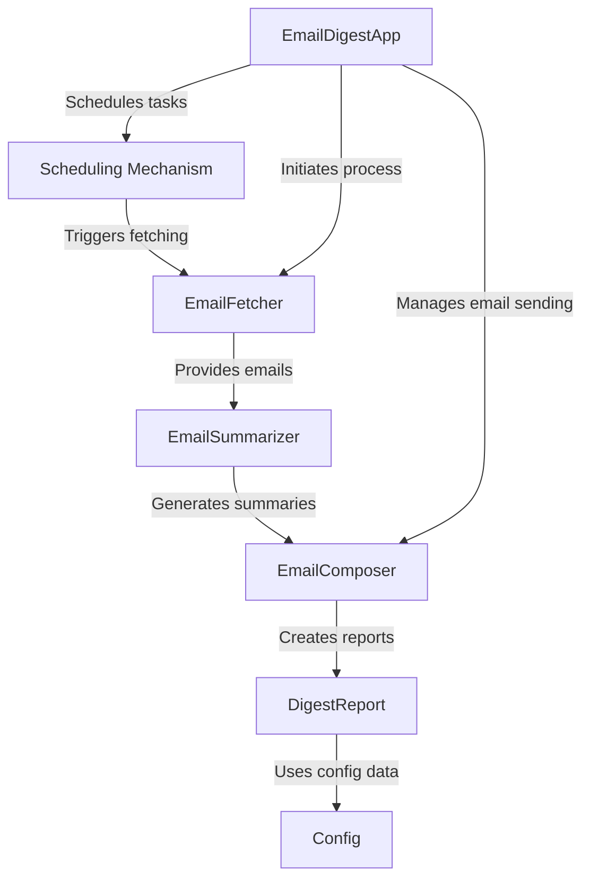
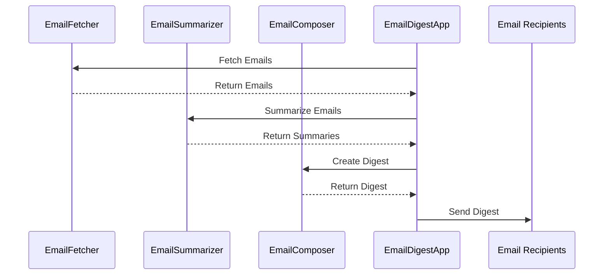
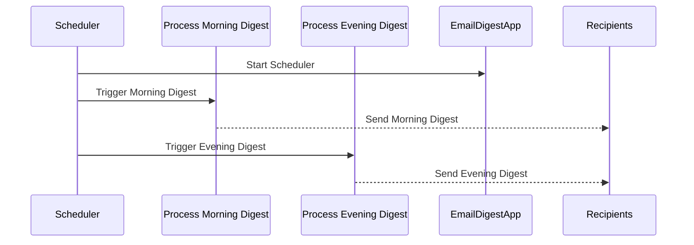
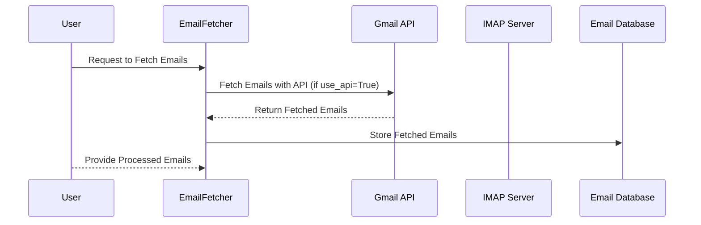
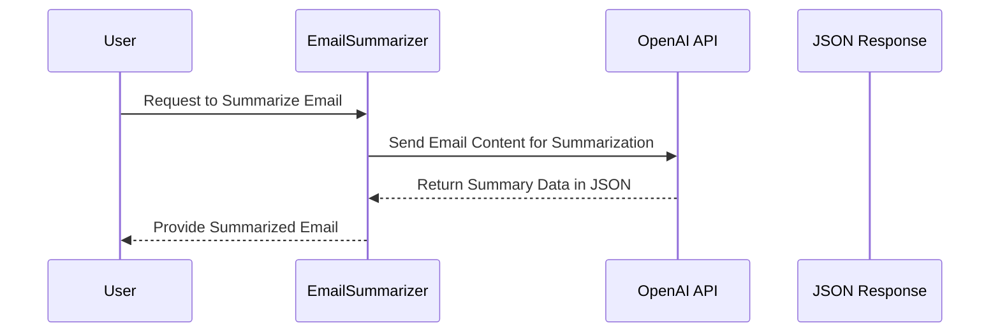
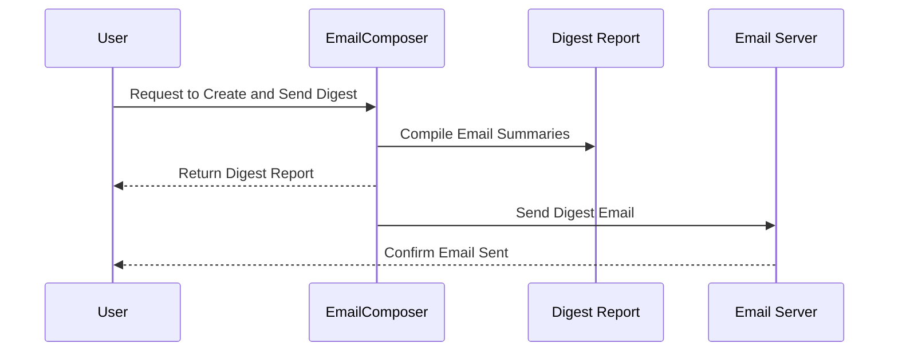
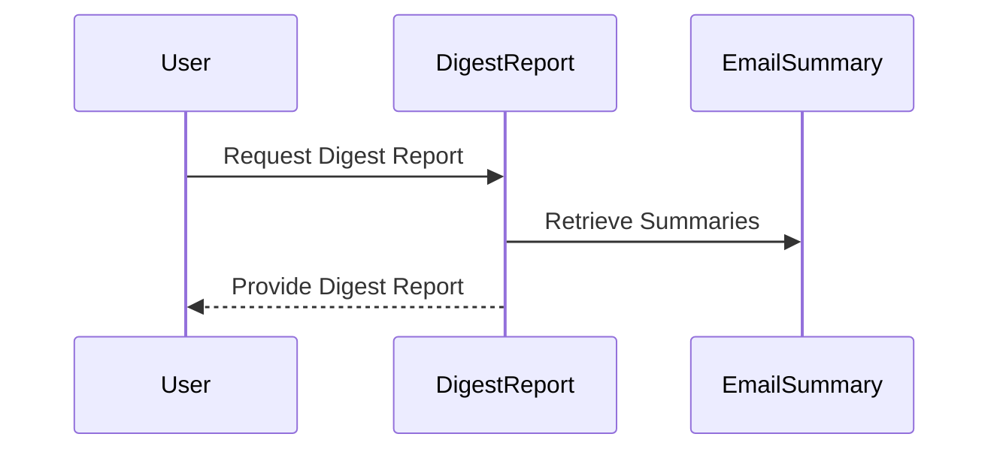
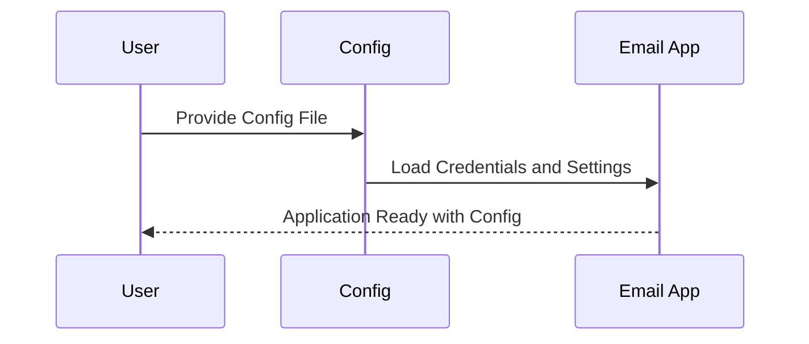

# EmailDigestApp



Welcome to the first chapter of our journey into the world of `bored-email`! In this chapter, we will introduce the `EmailDigestApp`, a vital component of our project that simplifies the way we process and manage email digests.


## What is EmailDigestApp?

Think of the `EmailDigestApp` as the conductor of an orchestra. Just as a conductor brings together different instruments to create beautiful music, the `EmailDigestApp` brings together various components—fetching, summarizing, and composing emails—into a harmonious email digest process. Its main job is to manage everything smoothly, ensuring that the email digests are generated and sent out in a timely manner. 

### Use Case: Daily Email Summaries

Imagine you receive hundreds of emails every day, and keeping track of important messages becomes overwhelming. Instead of sifting through each email, what if you could receive a concise summary of the most important ones every morning and evening? 

That's where `EmailDigestApp` comes in! It collects your emails, summarizes their contents, and sends you a digest, saving you from mental clutter. 

## Key Concepts of EmailDigestApp

To understand how `EmailDigestApp` works, let's break down its key components:

1. **Configuration Loading**: It loads important settings from a `.env` file, like your email credentials and schedule for sending digests.
2. **Fetching Emails**: It retrieves emails based on predefined time windows.
3. **Summarizing Emails**: It condenses the fetched emails into short summaries.
4. **Composing and Sending Digests**: It formats the summaries into a digest email and sends them out.
5. **Scheduling**: It ensures that the digests are processed at the correct times automatically.

### Example Input and Output

When you run the `EmailDigestApp`, it might look something like this:

- **Input**: 
    - Emails received: 10 emails 
    - Digests sent on: Morning at 7 AM, Evening at 9 PM.
  
- **Output**: 
    - Morning Digest: "Summary of Email 1, Summary of Email 2... (5 summaries)"
    - Evening Digest: "Summary of Email 6, Summary of Email 7... (5 summaries)"

## Internal Process of EmailDigestApp

Here's a step-by-step breakdown of what happens when you run the `EmailDigestApp`:



In this diagram, the `EmailDigestApp` first fetches the emails using the `EmailFetcher`, summarizes them with the `EmailSummarizer`, creates the digest through the `EmailComposer`, and finally sends the digest to the recipients.

### Diving Deeper: The Code Behind EmailDigestApp

Now let’s explore the code that makes this happen. Below is the class definition for `EmailDigestApp`.

```python
class EmailDigestApp:
    def __init__(self, env_path: str = ".env"):
        # Load configuration and set up components
        self.config = self._load_config(env_path)
        self.fetcher = EmailFetcher(self.config)
        self.summarizer = EmailSummarizer(self.config)
        self.composer = EmailComposer(self.config)
```

Here, the constructor initializes the application. It loads the configuration and sets up the necessary components like `EmailFetcher`, `EmailSummarizer`, and `EmailComposer`. This setup is vital because it prepares the app to start fetching, summarizing, and sending emails.

Next, let's see how we process the morning digest:

```python
def process_morning_digest(self):
    logger.info("Starting morning email digest process")
    emails = self.fetcher.fetch_emails(self.config.morning_cutoff_hours)
    summaries = self.summarizer.summarize_emails(emails)
    digest = self.composer.create_digest_report(summaries, "morning")
    self.composer.send_email(digest)
```

In this method, we:
1. Start the morning digest process.
2. Fetch emails based on the morning cutoff hours.
3. Summarize those emails.
4. Create a digest report from the summaries.
5. Finally, send the digest email.

This simple flow makes it easy for the `EmailDigestApp` to handle the daily email digests efficiently.

## Conclusion

We learned about the `EmailDigestApp`, which acts as the central hub for processing our email digests. We explored its key components and how they work together to simplify our email management. 

With this understanding, you’re now ready to dive into the next chapter, where we will explore the scheduling mechanism that automates the timing for our email digests: Scheduling Mechanism


# Chapter 2: Scheduling Mechanism

Welcome back! In the previous chapter, we introduced the **EmailDigestApp**, which organizes our email digests. Now, we’ll dive into an essential component of our application: the **Scheduling Mechanism**. This will help us automate tasks so our application can send email digests at specific times without any manual effort.

## What is the Scheduling Mechanism?

Imagine you have an alarm clock that wakes you up every morning at the same time. The **Scheduling Mechanism** functions similarly. It acts like an alarm for our application, ensuring that it wakes up and performs specific tasks at designated times—such as sending out email digests in the morning and evening.

### Use Case: Automatic Email Digests

Picture this: You want to receive a summary of your emails every morning at 7 AM and every evening at 9 PM, so you can stay updated without having to check your email every time. The scheduling mechanism takes care of this for us!

## Key Concepts of the Scheduling Mechanism

To understand the scheduling mechanism better, let’s break down the key concepts:

1. **Cron Jobs**: These are scheduled tasks that run at specific intervals or times. Our scheduling mechanism utilizes cron jobs to determine when to trigger email digests.
  
2. **Triggers**: These define the conditions for when to execute certain actions. In our case, we specify conditions for morning and evening digests.

3. **BlockingScheduler**: This is a tool that holds the application in a loop, allowing it to keep running and checking for scheduled tasks.

## Using the Scheduling Mechanism

Let’s see how we implement this scheduling mechanism in our application. We will look at some code examples and explain what they do.

### Scheduling the Morning and Evening Tasks

Here’s a snippet of code that sets up the scheduling for both morning and evening digests:

```python
def schedule_jobs(self):
    """Schedule the morning and evening digest jobs"""
    # Schedule morning digest (7 AM)
    self.scheduler.add_job(
        self.process_morning_digest,
        CronTrigger.from_crontab(self.config.morning_schedule),
        id='morning_digest'
    )
    
    # Schedule evening digest (9 PM)
    self.scheduler.add_job(
        self.process_evening_digest,
        CronTrigger.from_crontab(self.config.evening_schedule),
        id='evening_digest'
    )
```

In this part of the code:
- We define a function called `schedule_jobs` to add our morning and evening jobs to the scheduler.
- The `CronTrigger.from_crontab` method reads the schedule we set in our configuration, like "0 7 * * *" for 7 AM and "0 21 * * *" for 9 PM.

### What Happens Under the Hood?

When the scheduling mechanism runs, it will call the corresponding functions to process the email digests. Here's a simplified visual representation:



In this diagram:
- The Scheduler starts and triggers tasks at specified times.
- It calls the respective functions to process and send the morning and evening digests to the recipients.

### Internal Code Implementation

Now, let’s look at how the `EmailDigestApp` integrates the scheduling behind the scenes. Here is a simple approach to initialize our scheduler inside the app:

```python
def __init__(self, env_path: str = ".env"):
    """Initialize the application with configuration from .env file"""
    self.config = self._load_config(env_path)
    self.fetcher = EmailFetcher(self.config)
    self.summarizer = EmailSummarizer(self.config)
    self.composer = EmailComposer(self.config)
    self.scheduler = BlockingScheduler()  # Initialize the scheduler
```

In the above code:
- The `__init__` method of `EmailDigestApp` initializes the `BlockingScheduler`, which manages our scheduled jobs.
- It sets up other components like the `EmailFetcher`, `EmailSummarizer`, and `EmailComposer` for later use.

## Conclusion

In this chapter, we explored the **Scheduling Mechanism** and understood how it automates the email digest process. From using cron jobs to setting up triggers in our application, we’ve seen how our `EmailDigestApp` maintains an efficient scheduling system that saves us time and effort. 

Now that you have a solid grasp of the scheduling mechanism, you’re prepared to learn about fetching emails in the next chapter: EmailFetcher.


---

# Chapter 3: EmailFetcher

Welcome back! In the previous chapter, we learned about the **Scheduling Mechanism**, which automates when our email digests are generated and sent. Now, let’s dive into a crucial part of our application: the **EmailFetcher**. 

## What is EmailFetcher?

Imagine having a friendly mailman who delivers letters to your mailbox every day. The **EmailFetcher** serves a similar purpose but in the digital world. It’s responsible for collecting emails from your Gmail account for further processing. Depending on your setup, it can use the modern Gmail API or the traditional IMAP method to fetch your emails.

### Use Case: Gathering Recent Emails

Let’s start with a simple use case. Imagine you want to collect all the emails you received in the last 24 hours so you can summarize them. Instead of going through your inbox manually, the **EmailFetcher** does that job for you, allowing you to focus on what’s important.

## Key Concepts of EmailFetcher

To understand how the **EmailFetcher** works, let’s break down its key concepts:

1. **Configuration**: It uses a configuration file to know your email settings and preferences. This includes API keys or IMAP credentials.
  
2. **Fetching Methods**: The EmailFetcher can fetch emails using:
   - **Gmail API**: This is the modern approach that utilizes Google’s official API.
   - **IMAP**: A traditional method that works with many email clients and services.

3. **Email Collection**: It gathers the emails from your mailbox based on a specified time frame.

## Using EmailFetcher to Solve the Use Case

The EmailFetcher allows us to gather emails seamlessly. Here’s how you can use it:

### Example Input and Output

Suppose you want to fetch emails from the last 24 hours. 

- **Input**: 
    - Time Frame: Last 24 hours
    - Method: Using Gmail API (or IMAP)

- **Output**: 
    - A list of email summaries you can use for further processing.

### Basic Usage Example

Here’s a simple code snippet to illustrate how to use the EmailFetcher:

```python
# Import the EmailFetcher from your project
from email_fetcher import EmailFetcher

# Initialize the EmailFetcher
fetcher = EmailFetcher(config, use_api=True)  # Set use_api to True for Gmail API

# Fetch emails received in the last 24 hours
emails = fetcher.fetch_emails(hours_back=24)

# Output the fetched emails
for email in emails:
    print(f"From: {email.sender}, Subject: {email.subject}")
```

In the code above:
- We import the `EmailFetcher` class from our project.
- We create an instance of `EmailFetcher`, providing it with the necessary configuration and specifying to use the Gmail API.
- We call `fetch_emails` to retrieve emails from the last 24 hours and then print the sender and subject of each fetched email.

## Internal Process of EmailFetcher

Let’s explore what happens step-by-step when you call the `fetch_emails` function:



In this diagram:
1. The user requests to fetch emails.
2. The `EmailFetcher` checks if it should use the Gmail API or IMAP.
3. It fetches the emails using the selected method.
4. The emails are stored for further processing.
5. Finally, the user receives the processed emails.

### Diving Deeper: The Code Behind EmailFetcher

Now let's explore the code implementation behind the `EmailFetcher`. Here's a simplified version of how it works:

```python
class EmailFetcher:
    def __init__(self, config: Config, use_api: bool = False):
        self.config = config
        self.use_api = use_api
        if use_api:
            self._setup_gmail_api()  # Initialize Gmail API

    def fetch_emails(self, hours_back: int):
        if self.use_api:
            return self.fetch_recent_emails_api(hours_back)  # Must implement this method
        else:
            return self.fetch_recent_emails_imap(hours_back)  # Must implement this method
```

In the constructor:
- We initialize the `EmailFetcher` with a configuration object.
- We determine whether to use Gmail API based on the `use_api` flag. If it's `True`, we set up the API.

#### Fetching with Gmail API

Here’s an example code snippet that shows how the `fetch_recent_emails_api` method might look:

```python
def fetch_recent_emails_api(self, hours_back: int):
    # Calculate the time frame for fetching emails
    time_back = datetime.now() - timedelta(hours=hours_back)
    query = f"after:{int(time_back.timestamp())}"  # Create query for Gmail
    results = self.service.users().messages().list(userId='me', q=query).execute()
    
    # Process the messages and return them
    ...
```

In this part:
- We calculate the time frame to search the emails by subtracting from the current time.
- We create a query to find emails received after this calculated time.

## Conclusion

In this chapter, we introduced the **EmailFetcher**, an essential component that gathers emails from your Gmail account. We learned how to use it, the essential concepts behind its operation, and a glimpse of its internal workings. 

Now that you understand how the EmailFetcher collects emails, you’re ready to move on to the next chapter where we will explore the **EmailSummarizer**—the part of our 
application that condenses those emails into easy-to-read summaries. Let’s continue on this exciting journey: EmailSummarizer

---

# Chapter 4: EmailSummarizer

Welcome back! In the previous chapter, we explored the **EmailFetcher**, which collects your emails for further processing. Now, let’s delve into an essential component of our application: the **EmailSummarizer**. This handy tool acts like a smart assistant, helping you make sense of your emails quickly.

## What is EmailSummarizer?

Imagine you receive a barrage of emails every day, filled with important information, requests, and updates. It can be overwhelming to sift through all of it. The **EmailSummarizer** solves this problem by distilling each email into key points, action items, and prioritizing them. Instead of reading every email in detail, you get a concise summary that helps you quickly identify what's important.

### Use Case: Quick Email Insights

Consider this scenario: You received five emails about different project updates, meeting requests, and follow-ups. Instead of reading through each lengthy email, you just want to know:
- What are the key points?
- Are there any action items you need to address?
- How urgent are these emails?

The **EmailSummarizer** achieves all this efficiently!

## Key Concepts of EmailSummarizer

To understand how the **EmailSummarizer** works, let’s break down its key concepts:

1. **Email Structure**: Each email has specific parts, like the sender, subject, date, and body, which need to be analyzed to extract relevant information.

2. **Summarization Process**: This involves using an AI model to analyze the email body and create a summary. It distills the essential information, such as key points and action items.

3. **Priority Classification**: Based on urgency and importance, each email is assigned a priority level (High, Medium, or Low).

Now, let’s see how you can use the **EmailSummarizer** to tackle the email summary use case we just described.

### How to Use EmailSummarizer

Here’s a friendly guide to using the **EmailSummarizer** to summarize your emails! 

#### Example Input and Output

Suppose you want to summarize an email you just fetched. 

- **Input**: An email with:
    - Sender: `alice@example.com`
    - Subject: `Project Update`
    - Date: `2023-10-01`
    - Body: `The project is on track. Please update the document by Friday.`

- **Output**: A summary that includes:
    - Key Points: `["Project is on track", "Update the document by Friday"]`
    - Action Items: `["Update the document"]`
    - Priority: `Medium`

#### Example Code to Summarize Emails

Here’s how you can summarize an email using the `EmailSummarizer`:

```python
# Import the EmailSummarizer class from your project
from email_summarizer import EmailSummarizer
from models import EmailMessage

# Create an instance of EmailSummarizer with configuration
summarizer = EmailSummarizer(config)

# Create a sample email message
email = EmailMessage(
    message_id="123",
    sender="alice@example.com",
    subject="Project Update",
    date="2023-10-01",
    body="The project is on track. Please update the document by Friday."
)

# Summarize the email
summary = summarizer.summarize_email(email)

# Print the summary details
print("Key Points:", summary.key_points)
print("Action Items:", summary.action_items)
print("Priority:", summary.priority)
```

In this example:
- We import the `EmailSummarizer` and the `EmailMessage` model.
- We create an instance of `EmailSummarizer`.
- We define a sample email message and summarize it.
- Finally, we print the key points, action items, and priority from the summary.

## Internal Process of EmailSummarizer

Let’s take a peek behind the scenes at how the **EmailSummarizer** works when you call it to summarize an email. Here’s a simple representation:



In this diagram:
1. You (the user) request an email summary.
2. The **EmailSummarizer** sends the email content to an AI service (like OpenAI).
3. The AI service returns the summarized data in JSON format.
4. Finally, the summarizer provides the summarized email back to you.

### Diving Deeper: The Code Behind EmailSummarizer

Now, let's examine how the **EmailSummarizer** is implemented in the codebase. Below is a simplified version of the code that summarizes a single email:

```python
class EmailSummarizer:
    def __init__(self, config):
        self.config = config
        openai.api_key = config.openai_api_key  # Set up API key for OpenAI

    def summarize_email(self, email: EmailMessage):
        # Prepare the prompt with email details for summarization
        prompt = f"FROM: {email.sender}\nSUBJECT: {email.subject}\nBODY:\n{email.body}\nSummarize this."

        # Query the OpenAI API and receive the summary
        response = openai.ChatCompletion.create(
            model=self.config.openai_model,
            messages=[{"role": "user", "content": prompt}]
        )

        # Extract summary from the response
        summary_content = response.choices[0].message.content
        return self.parse_summary(summary_content)

    def parse_summary(self, summary_content):
        # Code to parse summary_content and return a structured summary
        ...
```

In the code above:
- We initialize the `EmailSummarizer` with configuration, including the OpenAI API key.
- The `summarize_email` method prepares a prompt that includes the email details.
- It sends the prompt to the AI model and retrieves a summary.
- Finally, the summary gets parsed into a structured format for easy use.

## Conclusion

In this chapter, we learned about the **EmailSummarizer**, which significantly enhances our ability to manage emails. By summarizing the key points, of each email and assigning priorities, you can quickly understand what requires your attention. 

With this knowledge, you’re well-equipped to explore the next component of our project: the **EmailComposer**, which allows us to create and send emails. Let’s continue our journey in the next chapter: EmailComposer.

---

# Chapter 5: EmailComposer

Welcome back! In the previous chapter, we explored the **EmailSummarizer**, a helpful tool that distills your emails into concise summaries. Now, let’s dive into the next important component of our project: the **EmailComposer**. 

## What is EmailComposer?

Think of the **EmailComposer** as a digital newsletter editor. It takes all the summarized emails from the **EmailSummarizer** and formats them beautifully into an HTML email. Its primary purpose is to assemble a digest based on the key points from the emails and then send this digest to your team to keep everyone informed. 

### Use Case: Sending Email Digests

Imagine you’ve received a summary of important emails and now you want to share that information with your team. Instead of sending individual emails, you can create a beautifully formatted email digest containing all the key points and action items. This allows your team to quickly grasp what’s important without having to read through every single email.

## Key Concepts of EmailComposer

To understand the **EmailComposer** better, let’s break it down into a few key concepts:

1. **Creating Digest Reports**: The **EmailComposer** gathers summaries and generates a report that provides insights like the total number of emails and action items.

2. **Formatting HTML Emails**: Beautifully formats the digest as an HTML email so that it looks nice and is easy to read.

3. **Sending Emails**: It uses SMTP (Simple Mail Transfer Protocol) to send the completed digest to your team members.

### How to Use EmailComposer

Now, let’s look at how to use the **EmailComposer** to create and send your email digest.

#### Example Input and Output

Suppose you want to send a morning digest after summarizing 5 emails collected from the previous day.

- **Input**:
    - Summarized Emails: 
        - Email 1: Action needed on Project A
        - Email 2: Meeting scheduled for 3 PM
        - Email 3: Update the documentation
        - Email 4: Reminder to complete the form
        - Email 5: Feedback required from the team
    - Period: Morning

- **Output**: A well-formatted HTML email that the recipients can open and read easily.

#### Code Example to Create and Send the Digest

Here’s how to use the **EmailComposer**:

```python
# Import the EmailComposer class from your project
from email_composer import EmailComposer
from models import DigestReport, EmailSummary

# Create an instance of EmailComposer with configuration
composer = EmailComposer(config)

# Sample summaries array (Here you can add real EmailSummary instances)
summaries = [
    EmailSummary(sender="alice@example.com", subject="Project Update", body="Details...", priority="High"),
    # Add other summaries...
]

# Create a digest report from the summaries
digest = composer.create_digest_report(summaries, period="morning")

# Send the email digest
success = composer.send_email(digest)

# Output result of email sending
print("Email sent successfully!" if success else "Failed to send email.")
```

In this example:
- We import the `EmailComposer` and the necessary models (`DigestReport`, `EmailSummary`).
- We create an instance of **EmailComposer**, then generate a digest report using email summaries.
- Lastly, we send the digest email and check if it was sent successfully.

## Internal Process of EmailComposer

Let’s dive into what happens behind the scenes when you call the EmailComposer. Here’s a simple sequence diagram to illustrate the process:



In this diagram:
1. You (the user) request the EmailComposer to create and send a digest.
2. The EmailComposer compiles the email summaries into a digest report.
3. After completing the report, it sends the email through an SMTP server.
4. Finally, you receive a confirmation that the email was sent.

### Diving Deeper: The Code Behind EmailComposer

Let’s take a closer look at how the **EmailComposer** is implemented in our project. Below is a simplified version of a method that creates the digest report:

```python
class EmailComposer:
    def create_digest_report(self, summaries: List[EmailSummary], period: str) -> DigestReport:
        """Creates a digest report based on email summaries"""
        high_priority_count = sum(1 for summary in summaries if summary.priority == "High")
        
        return DigestReport(
            period=period,
            email_count=len(summaries),
            high_priority_count=high_priority_count,
            summaries=summaries
        )
```

In the `create_digest_report` method:
- We count how many summaries are labeled as "High" priority.
- We then generate a `DigestReport` that contains the period of the report, the count of emails, the count of high-priority emails, and the summaries themselves.

Here’s how the method for sending emails looks:

```python
def send_email(self, digest: DigestReport) -> bool:
    """Sends the digest email to recipients"""
    # Additional code to create message and send it...
    try:
        server.sendmail(self.config.gmail_user, self.config.team_recipients, msg.as_string())
        return True
    except Exception as e:
        print(f"Error sending email: {str(e)}")
        return False
```

In the `send_email` method:
- It utilizes the SMTP server to send out the formatted email.
- If the sending is successful, it returns `True`; otherwise, it prints an error message and returns `False`.

## Conclusion

In this chapter, we learned about the **EmailComposer**, a crucial tool for creating and sending email digests. We explored how it compiles email summaries, formats them beautifully for readability, and sends them to your team. Now you have the knowledge to share key information effectively with others!

With this understanding, you’re ready to continue to the next exciting component of our project, the **DigestReport**: DigestReport.

---

# Chapter 6: DigestReport

Welcome back! In the previous chapter, we explored the **EmailComposer**, which beautifully assembles and sends your email digests. Now, we’re going to introduce you to the **DigestReport**, a crucial abstraction that helps organize and present the information from your emails clearly.

## What is DigestReport?

Think of the **DigestReport** as a report card for your emails. Imagine you have collected numerous email summaries and need a way to present this information in a digestible format. The **DigestReport** compiles statistics on total emails, counts of high-priority messages, and provides a structured summary of the emails received. It ensures that the recipients of the digest are well-informed without feeling overwhelmed.

### Use Case: Summarizing Daily Emails

Let’s consider a scenario where you receive many emails throughout the day. Every evening, you want a quick overview of what you received, focusing on the important points and urgent tasks. Using the **DigestReport**, you can send a well-structured report that highlights:

- The total number of emails received.
- How many of those were marked as high-priority.
- Summaries of each email for easy reference.

This allows your team to quickly catch up on what’s important without digging through every single email.

## Key Concepts of DigestReport

To understand how the **DigestReport** works, let's break down its key concepts:

1. **Email Count**: This refers to the total number of emails received within the specified time frame.

2. **High-Priority Count**: This tracks how many of those emails were marked as high priority, helping recipients focus on what requires urgent attention.

3. **Summaries**: These are the brief details of each email, providing a snapshot of important contents directly in the report.

### Example Input and Output

Now, let’s see how the **DigestReport** can be used. 

#### Input Example
You have received 10 emails, out of which 3 are marked as high priority. The summaries of these emails are ready for reporting. 

#### Desired Output
The generated `DigestReport` will contain:
- Total Emails Received: 10
- High-Priority Emails: 3
- Summarized Content of Each Email: A neat list of key points from each email.

Next, let’s look at how to create a **DigestReport** using it in code.

### Creating a DigestReport

Here’s how you can create a **DigestReport** from the email summaries:

```python
from models import DigestReport, EmailSummary

# Sample summaries from previous processing
summaries = [
    EmailSummary(sender="alice@example.com", subject="Project Update", key_points=["Project is on track"], action_items=["Update document"], priority="High"),
    EmailSummary(sender="bob@example.com", subject="Meeting Reminder", key_points=["Meeting at 3 PM"], action_items=[], priority="Medium"),
    # Add more summaries...
]

# Create a DigestReport instance
digest_report = DigestReport(
    period="evening",
    email_count=len(summaries),
    high_priority_count=len([s for s in summaries if s.priority == "High"]),
    summaries=summaries
)
```

In this code:
- We first import `DigestReport` and `EmailSummary`.
- We create a list of sample `EmailSummary` instances that represent the processed email summaries.
- We then create a `DigestReport` instance by providing the period, total email count, high-priority count, and the summaries.

### Internal Process of DigestReport

Now let’s walk through the internal workings when you create a **DigestReport**. Here’s a simple sequence diagram to illustrate the process:



In this diagram:
1. You, the user, request to create a **DigestReport**.
2. The **DigestReport** retrieves the email summaries associated with that request.
3. Finally, the **DigestReport** is provided back to you, containing the compiled information.

### Internal Code Implementation

Let’s look at how the **DigestReport** is implemented in the codebase. Here’s a simplified version of how the `DigestReport` model is structured:

```python
from pydantic import BaseModel
from typing import List
from datetime import datetime

class DigestReport(BaseModel):
    period: str
    date: datetime = Field(default_factory=datetime.now)
    email_count: int
    high_priority_count: int
    summaries: List[EmailSummary]
```

In this code:
- We define `DigestReport` with attributes for the report period, count of emails, count of high-priority emails, and the list of `EmailSummary` instances.
- `Field(default_factory=datetime.now)` automatically sets the report generation time.

## Conclusion

In this chapter, we learned about the **DigestReport**, which compiles and presents email information in a clear format. By creating a digest of the total number of emails and their priority levels, your team can efficiently stay informed about important communications.

Now that you understand how to create a **DigestReport**, you’re ready to move on to the following chapter where we will discuss configuration settings in our application: [Config].

---

# Chapter 7: Config

Welcome back! In the previous chapter, we explored the **DigestReport**, which helps compile and present the summaries of your emails in an organized way. Now, let's delve into a crucial aspect of our application: the **Config**. This is where all the magic begins!

## What is Config?

Think of **Config** as the control panel for your email digest system. It holds all the critical settings that allow the application to adapt to different users and setups without changing the core code. Just like a pilot needs controls for operating an airplane, **Config** provides the necessary configurations to tailor the behavior of your email digest application.

### Use Case: Customizing Your Email Digests

Imagine you’re using the `bored-email` application for the first time. You want to receive email digests every morning at 7 AM and evening at 9 PM, but your email account is different from your friend’s. Instead of digging into code to change those times manually, you can adjust settings in the **Config** file.

### Key Concepts of Config

Let’s break down the key concepts of the **Config** section to understand its structure better:

1. **Email Credentials**: These are your Gmail username and application-specific password. The application uses them to access your email account securely.

2. **Schedule Settings**: You can specify the times for fetching emails and sending digests. By default, the application might be set to check emails at specific times, but you can change this.

3. **API Keys**: If your app integrates with external services, like OpenAI for summarization, you’ll need API keys. The **Config** provides a place to keep these keys safe.

4. **Limits**: Sometimes, you may want to limit how many emails are included in your digest. This is especially useful if you receive a high volume of emails.

### Using the Config

Let’s see how you can set up the **Config** to tailor your email digests!

#### Example Input and Output

Suppose you want to set your configuration for the `bored-email` application.

- **Input**: A `.env` file with the following contents:
    ```
    GMAIL_USER=your_email@gmail.com
    GMAIL_APP_PASSWORD=your_app_password
    OPENAI_API_KEY=your_openai_api_key
    TEAM_RECIPIENTS=recipient1@example.com,recipient2@example.com
    MORNING_SCHEDULE=0 7 * * *
    EVENING_SCHEDULE=0 21 * * *
    MAX_EMAILS_PER_DIGEST=50
    ```

- **Output**: The application now knows when to fetch emails, who to send digests to, and how to access your email account successfully!

### Internal Process of Config

Now let's walk through what happens when the **Config** is loaded. Here’s a simple representation of that process:



In this diagram:
1. You (the user) provide a config file with all the necessary settings.
2. The **Config** class loads those settings.
3. The email application is now configured and ready to go!

### Internal Code Implementation

Let’s take a peek into how the **Config** is structured in the codebase. Here’s a simplified version of the `Config` model:

```python
from pydantic import BaseModel
from typing import List

class Config(BaseModel):
    gmail_user: str
    gmail_app_password: str
    openai_api_key: str
    team_recipients: List[str]
    morning_schedule: str = "0 7 * * *"  # Default Schedule
    evening_schedule: str = "0 21 * * *"  # Default Schedule
    max_emails_per_digest: int = 50       # Default limit
```

In this code:
- We define the `Config` class using Pydantic, which helps validate input and ensure everything is structured.
- Each attribute corresponds to a setting we discussed earlier, with default values for ease of use.

### Conclusion

In this chapter, we learned about the **Config** and how it serves as the configuration hub for the email digest application. By setting up the **Config** properly, you can customize your experience without diving deep into the code. This flexibility is essential for any user-friendly application!

---

